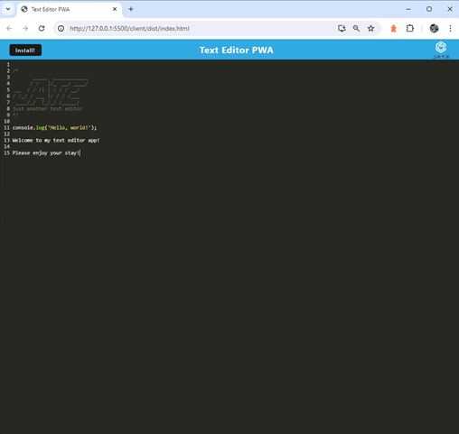
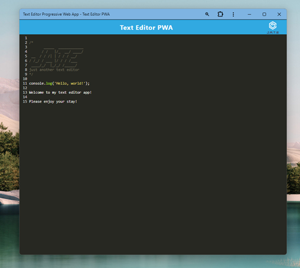

# Text Editor PWA

## Overview
A Progressive Web Application that offers a rich text editing experience. It allows users to create, edit, and manage text entries in an efficient manor. The application operates in standalone mode when installed, providing a native-like experience on both desktop and mobile devices.

## Table of Contents
- [Features](#features)
- [Usage](#usage)
- [Contributing](#contributing)
- [Questions](#questions)
- [Credits](#credits)

## Features

1. Editable Text Area

    * A main text area powered by CodeMirror that offers various features such as syntax highlighting and line numbering.

2. Data Management

    * All entries are automatically saved to IndexedDB.
    * Any changes to the text editor are tracked in real time, allowing the auto-save feature to prevent any data loss.
    * Because of this, users can update existing entries or add new ones without losing any data between sessions.

3. Installation

    * Thanks to PWA technology, this application can be installed on a user's devices. Once installed, it can be launched from the user's home screen or applications menu.
    * For ease of installation, an 'Install!" button has been included as a header across the top of the webpage. Simply click this button and the app will be installed.

4. Service Worker

    * A service worker has been implemented to handle asset caching and offline capabilities, improving load times and performance, and allowing a user to use the application even without an internet connection.

5. Technologies Used

    * JavaScript
    * Express.js
    * Webpack
    * Babel
    * CodeMirror
    * Workbox
    * Node.js
    * IDB
    * Nodemon
    * Concurrently
    * VSCode
    * Git Bash
    * GitHub
    * Render

## Usage

To view this project's repository, please visit https://github.com/JoshMassa/text-editor-pwa

To use this app in your browser, please visit https://text-editor-pwa-k5pn.onrender.com/

When using this app in your browser, the webpage should resemble the following image:

When using the installed version of this app, the app should resemble the following image:

1. Code Editing
    
    * Target Users: Developers, programmers, students
    * Use Case: Writing and editing code with support for syntax highlighting and various language-specific functionalities.

2. Markdown Editing

    * Target Users: Content creators, bloggers, writers
    * Use Case: Writing and formatting markdown documents.

3. General Text Editing

    * Target Users: General public, students, professionals
    * Use Case: General-purpose text editing for creating and editing documents, notes, and text files. This can include documents such as essays, reports, or any other text-based content.

## Contributing

To contribute to this project, follow these steps:

    1. Clone the repository

    2. Install necessary dependencies using the command 'npm install' in your terminal

    3. Make your changes and commit them, ensuring to test all changes for any bugs prior to committing them

    4. Push your local changes to the repository and submit a pull request

## Questions

You can find my GitHub profile [here](https://www.github.com/JoshMassa). 

If you have any questions, you can email me by clicking [here](mailto:joshuamassapelletier@outlook.com).

## Credits

Webpack Docs - https://webpack.js.org/guides/

Manifest Docs - https://www.npmjs.com/package/webpack-pwa-manifest

